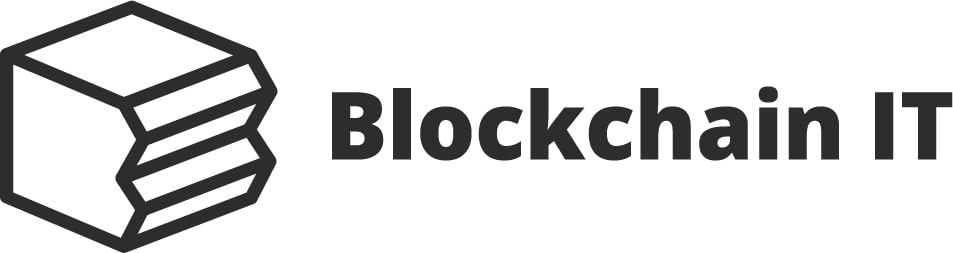

# Ethererum Proof of Authority Clique Kubernetes template
Use this template to start Proof of Authority network on your kubernetes cluster or locally on minikube.

## Kubernetes 
To start network using kubectl use:
sh start.sh

To start it locally in minikube use:
sh start_in_minikube.sh

To sync locally use:
sync_locally.sh (just change enode to your endpoint)

Medium article to help you get started: https://medium.com/@edi.sinovcic/ethererum-poa-clique-on-kubernetes-6e86fed0c310
